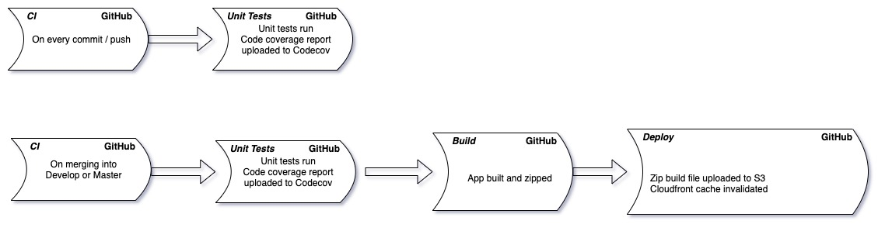

# Microfront ends


This project serves as an example and documentation for building front ends to slot into VIA 3. It currently deploys to S3, but this is not a requirement for other microfrontends - we do not wish to be perscriptive in terms of pipeline technologies, just that the front end should be accessible over the internet.

## App details
This project was generated with [Angular CLI](https://github.com/angular/angular-cli) version 11.2.2. You can access it online without VIA 3 using [https://d8ul6iy0rxmlk.cloudfront.net](https://d8ul6iy0rxmlk.cloudfront.net).

### Development server

Run `ng serve` for a dev server. Navigate to `http://localhost:4200/`. The app will automatically reload if you change any of the source files.

### Code scaffolding

Run `ng generate component component-name` to generate a new component. You can also use `ng generate directive|pipe|service|class|guard|interface|enum|module`.

### Build

Run `ng build` to build the project. The build artifacts will be stored in the `dist/` directory. Use the `--prod` flag for a production build.

### Running unit tests

Run `ng test` to execute the unit tests via [Karma](https://karma-runner.github.io).

### Running end-to-end tests

Run `ng e2e` to execute the end-to-end tests via [Protractor](http://www.protractortest.org/).

### Further help

To get more help on the Angular CLI use `ng help` or go check out the [Angular CLI Overview and Command Reference](https://angular.io/cli) page.

## Styling and theming

This app makes use of Angular Material that has been themed in compliance with the designs for VIA 3. You are free to use it as is from this project. For more information on theming angular material apps, please see [the official documentation](https://material.angular.io/guide/theming).

The theme was generated using an online theme generator. You can fork, or change this theme using [the generator here](https://materialtheme.arcsine.dev/?c=YHBhbGV0dGU$YHByaW1hcnk$YF48I2ZmM2IzMCIsIj9lcjwjZmZjNGMxIiwiO2VyPCNmZjI2MWV$LCIlPmBePCNmOWY5ZjkiLCI~ZXI8I2ZkZmRmZCIsIjtlcjwjZjZmNmY2fiwid2Fybj5gXjwjZTExYjIyIiwiP2VyPCNmNmJiYmQiLCI7ZXI8I2Q1MTAxNH4sIj9UZXh0PCMwMDAwMDAiLCI~PTwjZjlmOWY5IiwiO1RleHQ8I2ZmZmZmZiIsIjs9PCMyYzJjMmN$LCJmb250cz5bYEA8KC00IiwiZmFtaWx5PEFyY2hpdm9$LGBAPCgtMyIsImZhbWlseTxBcmNoaXZvfixgQDwoLTIiLCJmYW1pbHk8QXJjaGl2b34sYEA8KC0xIiwiZmFtaWx5PEFyY2hpdm9$LGBAPGhlYWRsaW5lIiwiZmFtaWx5PEFyY2hpdm9$LGBAPHRpdGxlIiwiZmFtaWx5PEFyY2hpdm9$LGBAPHN1YiktMiIsImZhbWlseTxBcmNoaXZvfixgQDxzdWIpLTEiLCJmYW1pbHk8QXJjaGl2b34sYEA8Ym9keS0yIiwiZmFtaWx5PEFyY2hpdm9$LGBAPGJvZHktMSIsImZhbWlseTxBcmNoaXZvfixgQDxidXR0b24iLCJmYW1pbHk8QXJjaGl2b34sYEA8Y2FwdGlvbiIsImZhbWlseTxBcmNoaXZvfixgQDxpbnB1dCIsImZhbWlseTxBcmNoaXZvIiwic2l6ZT5udWxsfV0sImljb25zPEZpbGxlZCIsIj9uZXNzPnRydWUsInZlcnNpb24$MTJ9).

## API

This app integrates with [Dad Jokes API](https://icanhazdadjoke.com/api) to deliver some integrated content. The main idea is to provide examples for cases when some input is received from the surrounding app - so from VIA3, and for cases when no input is received.

## Naming Conventions
We prefer the use of prefixes for the components you will be creating. In VIA 3 we use the prefix `<via-core...`, similarly you should us your appname and then the purpose of your component. So, for example `<dadjokes-random>` or `<dadjokes-search-results>`. 


## Things that don't work, yet

Using custom path alliases does not work once the module is pulled into VIA Core. I haven't been able to get it working, so I've excluded it from scope for now.

This is when you specify custom paths in tsconfig - [check out path mapping](https://www.typescriptlang.org/docs/handbook/module-resolution.html#path-mapping).

## Important additions for Microfrontend architecture

This app is an example of running the site as well as using it as a web component in VIA. That means it has some other surrounding components that are not necessary when included in VIA - that being the app routing (routing will be controlled by VIA), layout and path resolver services. That is why there is a `microfrontend.module.ts` -> this file is included in VIA for rendering the web components, whilst the app.module is used to render the app as a standalone application.

### How these components are used in VIA
There is a module file for the specific webcomponents in this project - it will be similar for any other components we include in VIA, we will attempt to group them into a module and folder, for organisation on our side.

Here is the code in VIA. The SimpleWebComponent renders random dad jokes, whilst the ParameterisedWebComponent renders the dad joke search component. These are hooked up in the navigation as two different routes in VIA. This repository is used in VIA as a submodule, and is built, tested and deployed along with VIA during releases.

```
@NgModule({
  declarations: [SimpleWebComponent, ParameterisedWebComponent],
  providers: [DadJokeService],
  imports: [BrowserModule, RouterModule, MicroFrontendModule],
  schemas: [CUSTOM_ELEMENTS_SCHEMA],
  entryComponents: [RandomJokeComponent]
})
export class WebComponentsExampleModule {
  constructor(private injector: Injector) {
    const strategyFactory = new ElementZoneStrategyFactory(RandomJokeComponent, injector);
    const randomJokeComponent = createCustomElement(RandomJokeComponent, {
      injector,
      strategyFactory
    });
    const searchJokeComponent = createCustomElement(SearchJokeComponent, {
      injector,
      strategyFactory
    });
    customElements.define('dadjoke-random', randomJokeComponent);
    customElements.define('dadjoke-search', searchJokeComponent);
  }
}
```

The build and deployment flow:



You can also see it in the deploy.yaml file in this repository - VIA follows a similar build and deployment flow.
